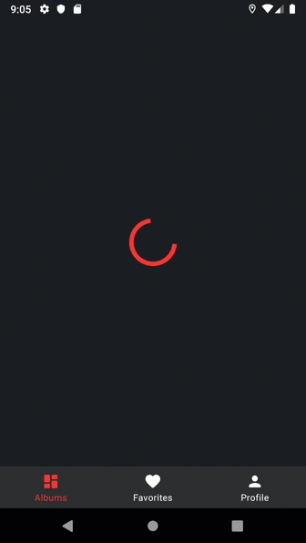

# Android showcase

[](https://kotlinlang.org)
[](https://developer.android.com/studio/releases/gradle-plugin)
[](https://gradle.org)

[](https://codebeat.co/projects/github-com-igorwojda-android-showcase-master)
[](https://app.codacy.com/app/igorwojda/android-showcase?utm_source=github.com&utm_medium=referral&utm_content=igorwojda/android-showcase&utm_campaign=Badge_Grade_Dashboard)
[](https://www.codefactor.io/repository/github/igorwojda/android-showcase)


Showcase is a sample project that presents a modern, 2020 approach to
[Android](https://en.wikipedia.org/wiki/Android_(operating_system)) application development with up to date tech-stack.

The goal of the project is to demonstrate best practices by using up to date tech-stack and presenting mod  ern Android application
[Architecture](#architecture) that is modular, scalable, maintainable, and testable. This application may look quite simple,
but it has all of these small details that will set the rock-solid foundation for the larger app suitable for bigger teams
and long [application lifecycle](https://en.wikipedia.org/wiki/Application_lifecycle_management).

This project is being maintained to match current industry standards. Please check [CONTRIBUTING](CONTRIBUTING.md) page if you want to help.

## Project characteristics

This project brings to table set of best practices, tools, and solutions:

* 100% [Kotlin](https://kotlinlang.org/)
* Modern architecture (dynamic feature modules, Clean Architecture, Model-View-ViewModel, Model-View-Intent)
* [Android Jetpack](https://developer.android.com/jetpack)
* A single-activity architecture ([Navigation component](https://developer.android.com/guide/navigation/navigation-getting-started))
* Reactive UI
* CI pipeline ([GitHub Actions](https://github.com/features/actions))
* Testing (Unit, UI)
* Static analysis tools
* Dependency Injection
* Material design

## Tech-stack



Min API level is set to [`21`](https://android-arsenal.com/api?level=21), so the presented approach is suitable for over
[85% of devices](https://developer.android.com/about/dashboards) running Android. This project takes advantage of many
popular libraries and tools of the Android ecosystem. Most of the libraries are in the stable version unless there is a
good reason to use non-stable dependency.

* Tech-stack
    * [Kotlin](https://kotlinlang.org/) + [Coroutines](https://kotlinlang.org/docs/reference/coroutines-overview.html) - perform background operations
    * [Kodein](https://kodein.org/Kodein-DI/) - dependency injection
    * [Retrofit](https://square.github.io/retrofit/) - networking
    * [Jetpack](https://developer.android.com/jetpack)
        * [Navigation](https://developer.android.com/topic/libraries/architecture/navigation/) - deal with whole in-app navigation
        * [LiveData](https://developer.android.com/topic/libraries/architecture/livedata) - notify views about database change
        * [Lifecycle](https://developer.android.com/topic/libraries/architecture/lifecycle) - perform an action when lifecycle state changes
        * [ViewModel](https://developer.android.com/topic/libraries/architecture/viewmodel) - store and manage UI-related data in a lifecycle conscious way
  *   [Coil](https://github.com/coil-kt/coil) - image loading library with Kotlin idiomatic API
  *   [Lottie](http://airbnb.io/lottie) - animation library
    * [Stetho](http://facebook.github.io/stetho/) - application debugging tool
    * [and more...](https://github.com/igorwojda/android-showcase/blob/master/buildSrc/src/main/kotlin/LibraryDependency.kt)
* Architecture
    * Clean Architecture (at module level)
    * MVVM + MVI (presentation layer)
    * [Dynamic feature modules](https://developer.android.com/studio/projects/dynamic-delivery)
    * [Android Architecture components](https://developer.android.com/topic/libraries/architecture) ([ViewModel](https://developer.android.com/topic/libraries/architecture/viewmodel), [LiveData](https://developer.android.com/topic/libraries/architecture/livedata), [Navigation](https://developer.android.com/jetpack/androidx/releases/navigation), [SafeArgs](https://developer.android.com/guide/navigation/navigation-pass-data#Safe-args) plugin)
* Tests
    * [Unit Tests](https://en.wikipedia.org/wiki/Unit_testing) ([JUnit](https://junit.org/junit4/))
    * [Mockk](https://mockk.io/)
    * [Kluent](https://github.com/MarkusAmshove/Kluent)
* Gradle
    * [Gradle Kotlin DSL](https://docs.gradle.org/current/userguide/kotlin_dsl.html)
    * Custom tasks
    * Plugins ([Ktlint](https://github.com/JLLeitschuh/ktlint-gradle), [Detekt](https://github.com/arturbosch/detekt#with-gradle), [Versions](https://github.com/ben-manes/gradle-versions-plugin), [SafeArgs](https://developer.android.com/guide/navigation/navigation-pass-data#Safe-args))

## Architecture

Feature related code is placed inside one of the feature modules.
We can think about each feature as the equivalent of [microservice](https://en.wikipedia.org/wiki/Microservices) or private library.

The modularized code-base approach provides few benefits:
- better [separation of concerns](https://en.wikipedia.org/wiki/Separation_of_concerns). Each module has a clear API., Feature related classes life in different modules and can't be referenced without explicit module dependency.
- features can be developed in parallel eg. by different teams
- each feature can be developed in isolation, independently from other features
- faster compile time

### Module types and module dependencies

This is a diagram present dependencies between project modules (Gradle sub-projects).


Note that due usage of Android `dynamic-feature` module dependencies are reversed (feature modules are depending on `app` module, not another way around).

We have three kinds of modules in the application:

- `app` module - this is the main module. It contains code that wires multiple modules together (dependency injection setup, `NavHostActivity`, etc.) and fundamental application configuration (retrofit configuration, required permissions setup, custom application class, etc.).
- helper modules
  - application-independent `library_base` module containing common code base that could be reused in other projects/applications (this code is not specific to this application) eg. base classes, utilities, custom delegates, extensions.
  - additional application-specific `library_x` modules that some of the features could depend on. This is helpful if you want to share some assets or code only between few feature modules (currently app has no such modules)
- feature modules - the most common type of module containing all code related to a given feature.

### Feature module structure

`Clean architecture` is the "core architecture" of the application, so each `feature module` contains own set of Clean architecture layers:


> Notice that `app` module and `library_x` modules structure differs a bit from feature module structure.

Each feature module contains non-layer components and 3 layers with distinct set of responsibilities.


#### Presentation layer

This layer is closest to what the user sees on the screen. The `presentation` layer is a mix of `MVVM` (Jetpack `ViewModel` used to preserve data across activity restart) and
`MVI` (`actions` modify the `common state` of the view and then new state is edited to a view via `LiveData` to be rendered).

> `common state` (for each view) approach derives from
> [Unidirectional Data Flow](https://en.wikipedia.org/wiki/Unidirectional_Data_Flow_(computer_science)) and [Redux
> principles](https://redux.js.org/introduction/three-principles).

Components:
- **View (Fragment)** - presents data on the screen and pass user interactions to View Model. Views are hard to test, so they should be as simple as possible.
- **ViewModel** - dispatches (through `LiveData`) state changes to the view and deals with user interactions (these view models are not simply [POJO classes](https://en.wikipedia.org/wiki/Plain_old_Java_object)).
- **ViewState** - common state for a single view
- **NavManager** - singleton that facilitates handling all navigation events inside `NavHostActivity` (instead of separately, inside each view)

#### Domain layer

This is the core layer of the application. Notice that the `domain` layer is independent of any other layers. This allows to make domain models and business logic independent from other layers.
In other words, changes in other layers will have no effect on `domain` layer eg. changing database (`data` layer) or screen UI (`presentation` layer) ideally will not result in any code change withing `domain` layer.

Components:
- **UseCase** - contains business logic
- **DomainModel** - defies the core structure of the data that will be used within the application. This is the source of truth for application data.
- **Repository interface** - required to keep the `domain` layer independent from the `data layer` ([Dependency inversion](https://en.wikipedia.org/wiki/Dependency_inversion_principle)).

#### Data layer

Manages application data and exposes these data sources as repositories to the `domain` layer. Typical responsibilities of this layer would be to retrieve data from the internet and optionally cache this data locally.

Components:
- **Repository** is exposing data to the `domain` layer. Depending on application structure and quality of the external APIs repository can also merge, filter, and transform the data. The intention of
these operations is to create high-quality data source for the `domain` layer, not to perform any business logic (`domain` layer `use case` responsibility).

- **Mapper** - maps `data model` to `domain model` (to keep `domain` layer independent from the `data` layer).
- **RetrofitService** - defines a set of API endpoints.
- **DataModel** - defines the structure of the data retrieved from the network and contains annotations, so Retrofit (Moshi) understands how to parse this network data (XML, JSON, Binary...) this data into objects.

### Data flow

Below diagram presents application data flow when a user interacts with `album list screen`:


## External dependencies

All the external dependencies (external libraries) are defined in the single place - Gradle `buildSrc` folder. This approach allows to easily
manage dependencies and use the same dependency version across all modules. Because each feature module depends on the `app` module
we can easily share all core dependencies without redefining them in each feature module.

[and more...](https://github.com/igorwojda/android-showcase/blob/master/buildSrc/src/main/kotlin/LibraryDependency.kt)

## Ci pipeline

[CI pipeline](https://github.com/igorwojda/android-showcase/tree/master/.github/workflows) verifies project correctness which each PR.
All of the tasks run in parallel:

These are all of the Gradle tasks that are [GitHub Actions](https://github.com/features/actions):
* `./gradlew lintDebug` - runs Android lint
* `./gradlew detekt` - runs detekt
* `./gradlew ktlintCheck` - runs ktlint
* `./gradlew testDebugUnitTest` - run unit tests
* `./gradlew connectedCheck` - run UI tests
* `./gradlew :app:bundleDebug` - create app bundle

### Design decisions

Read related articles to have a better understanding of underlying design decisions and various trade-offs.

* [Multiple ways of defining Clean Architecture layers](https://proandroiddev.com/multiple-ways-of-defining-clean-architecture-layers-bbb70afa5d4a)
* More coming soon

## What this project does not cover?

The interface of the app utilizes some of the modern material design components, however, is deliberately kept simple to
focus on application architecture.

## Upcoming improvements

Checklist of all upcoming [enhancements](https://github.com/igorwojda/android-showcase/issues?q=is%3Aissue+is%3Aopen+sort%3Aupdated-desc+label%3Aenhancement).

## Getting started

There are a few ways to open this project.

### Android Studio

1. Android Studio -> File -> New -> From Version control -> Git
2. Enter `https://github.com/igorwojda/android-showcase.git` into URL field

### Command-line + Android Studio

1. Run `git clone https://github.com/igorwojda/android-showcase.git`
2. Android Studio -> File -> Open

## Inspiration

This is project is a sample, to inspire you and should handle most of the common cases, but please take a look at
additional resources.

### Cheat sheet

* [Android Ecosystem Cheat Sheet](https://github.com/igorwojda/android-ecosystem-cheat-sheet) - board containing 200+ most important tools
* [Kotlin Coroutines - Use Cases on Android](https://github.com/LukasLechnerDev/Kotlin-Coroutine-Use-Cases-on-Android) - most popular coroutine usages

### Android projects

Other high-quality projects will help you to find solutions that work for your project:

* [Iosched](https://github.com/google/iosched) - official Android application from google IO 2019
* [Android Architecture Blueprints v2](https://github.com/googlesamples/android-architecture) - a showcase of various
  Android architecture approaches
* [Android sunflower](https://github.com/googlesamples/android-sunflower) complete `Jetpack` sample covering all
  libraries
* [GithubBrowserSample](https://github.com/googlesamples/android-architecture-components) - multiple small projects
  demonstrating usage of Android Architecture Components
* [Plaid](https://github.com/android/plaid) - a showcase of Android material design
* [Clean Architecture boilerplate](https://github.com/bufferapp/android-clean-architecture-boilerplate) - contains nice
  diagrams of Clean Architecture layers
* [Android samples](https://github.com/android) - official Android samples repository
* [Roxie](https://github.com/ww-tech/roxie) - solid example of `common state` approach together witch very good
  documentation
* [Kotlin Android template](https://github.com/cortinico/kotlin-android-template) - template that lets you create an Android/Kotlin project and be up and running in a few seconds. 

## Known issues
- `ktlint` `import-ordering` rule conflicts with IDE default formatting rule, so it have to be [disabled](.editorconfig)
- False positive "Unused symbol" for a custom Android application class referenced in AndroidManifest.xml file ([Issue](https://youtrack.jetbrains.net/issue/KT-27971))
- False positive "Function can be private" ([Issue](https://youtrack.jetbrains.com/issue/KT-33610))
- Unit tests are running in IDE but fail after running gradle task because of missing Agrs class ([Issue](https://issuetracker.google.com/issues/139242292))

## Contribute

Want to contribute? Check our [Contributing](CONTRIBUTING.md) docs.

## Author

[](https://twitter.com/igorwojda)

[](https://twitter.com/igorwojda)

## License
```
MIT License

Copyright (c) 2019 Igor Wojda

Permission is hereby granted, free of charge, to any person obtaining a copy of this software and 
associated documentation files (the "Software"), to deal in the Software without restriction, including 
without limitation the rights to use, copy, modify, merge, publish, distribute, sublicense, and/or sell 
copies of the Software, and to permit persons to whom the Software is furnished to do so, subject to 
the following conditions:

The above copyright notice and this permission notice shall be included in all copies or substantial 
portions of the Software.

THE SOFTWARE IS PROVIDED "AS IS", WITHOUT WARRANTY OF ANY KIND, EXPRESS OR IMPLIED, INCLUDING BUT NOT 
LIMITED TO THE WARRANTIES OF MERCHANTABILITY, FITNESS FOR A PARTICULAR PURPOSE AND NONINFRINGEMENT. IN 
NO EVENT SHALL THE AUTHORS OR COPYRIGHT HOLDERS BE LIABLE FOR ANY CLAIM, DAMAGES OR OTHER LIABILITY, 
WHETHER IN AN ACTION OF  TORT OR OTHERWISE, ARISING FROM, OUT OF OR IN CONNECTION WITH THE 
SOFTWARE OR THE USE OR OTHER DEALINGS IN THE SOFTWARE.
```

## Animations License
Flowing animations and are distributed under `Creative Commons License 2.0`:
- [Error screen](https://lottiefiles.com/8049-error-screen) by Chetan Potnuru
- [Building Screen](https://lottiefiles.com/1271-building-screen) by Carolina Cajazeira
