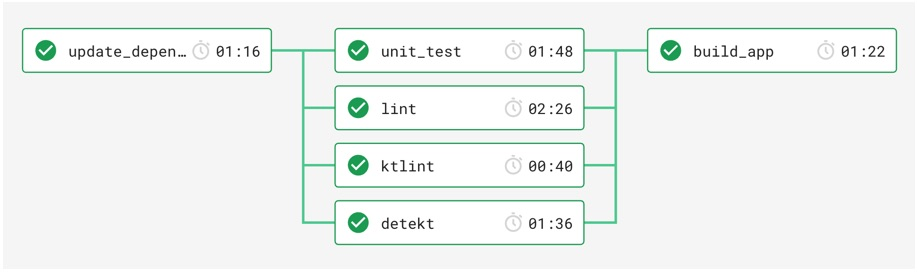

# Project description
[](https://circleci.com/gh/igorwojda/android-showcase)
[](http://kotlinlang.org/)
[](https://android-arsenal.com/api?level=21)

[](https://codebeat.co/projects/github-com-igorwojda-android-showcase-master)
[](https://app.codacy.com/app/igorwojda/android-showcase?utm_source=github.com&utm_medium=referral&utm_content=igorwojda/android-showcase&utm_campaign=Badge_Grade_Dashboard)
[](https://www.codefactor.io/repository/github/igorwojda/android-showcase)


Showcase is a sample project that presents modern, 2019 approach to
[Android](https://en.wikipedia.org/wiki/Android_(operating_system)) application development using
[Kotlin](https://kotlinlang.org/) and latest tech-stack.

The goal of the project is to demonstrate best practices, provide set of guidelines, and present modern Android
application architecture that is modular, scalable, maintainable and testable. This application may look simple, but it
has all of these small details that will set the rock solid foundation of the larger app suitable for bigger teams and
long [application lifecycle](https://en.wikipedia.org/wiki/Application_lifecycle_management). Many of the project design
decisions follows official Google recommendations.

This project is being heavily maintained to match current industry standards. In upcoming weeks (Aug-Dec 2019) I plan to
write series of articles explaining many of this project architectural design decisions, so
[stay tuned](https://twitter.com/igorwojda).

## Project characteristics

This project bring to table set of best practices, tools and solutions:

* 100% [Kotlin](https://kotlinlang.org/)
* Modern architecture (feature modules, Clean Architecture, Model-View-ViewModel)
* [Android Jetpack](https://developer.android.com/jetpack)
* A single-activity architecture, using the Navigation component to manage fragment operations
  * Reactive UIs
* CI pipeline
* Testing
* Static analysis tools
* Dependency Injection
* Material design

## Tech-stack


Min API level is set to [`21`](https://android-arsenal.com/api?level=21), so presented approach is suitable for over
[85% of devices](https://developer.android.com/about/dashboards) running Android. This project takes advantage of many
popular libraries and tools of the Android ecosystem. Most of the libraries are in stable version, unless there is a
good reason to use non-stable dependency.

* Tech-stack
    * [Kotlin](https://kotlinlang.org/) + [Coroutines](https://kotlinlang.org/docs/reference/coroutines-overview.html) - Perform background operations
    * [Kodein](https://kodein.org/Kodein-DI/) - Dependency injection
    * [Retrofit](https://square.github.io/retrofit/) - Retrieve data from network
    * [Jetpack](https://developer.android.com/jetpack)
        * [Navigation](https://developer.android.com/topic/libraries/architecture/navigation/) - deal with whole in-app navigation
        * [LiveData](https://developer.android.com/topic/libraries/architecture/livedata) - notify views about database change
        * [Lifecycle](https://developer.android.com/topic/libraries/architecture/lifecycle) - perform action when lifecycle state changes
        * [ViewModel](https://developer.android.com/topic/libraries/architecture/viewmodel) - store and manage UI-related data in a lifecycle conscious way
    * [Picasso](https://square.github.io/picasso/) - deal with loading images
    * [Lottie](http://airbnb.io/lottie) - animation library
    * [Stetho](http://facebook.github.io/stetho/) - application debugging tool
    * [and more...](https://github.com/igorwojda/android-showcase/blob/master/buildSrc/src/main/kotlin/LibraryDependency.kt)
* Architecture
    * Clean Architecture (at module level)
    * MVVM (presentation layer)
    * [Dynamic feature modules](https://developer.android.com/studio/projects/dynamic-delivery)
    * [Android Architecture components](https://developer.android.com/topic/libraries/architecture) ([ViewModel](https://developer.android.com/topic/libraries/architecture/viewmodel), [LiveData](https://developer.android.com/topic/libraries/architecture/livedata), [Navigation](https://developer.android.com/jetpack/androidx/releases/navigation), [SafeArgs](https://developer.android.com/guide/navigation/navigation-pass-data#Safe-args) plugin)
* Tests
    * [Unit Tests](https://en.wikipedia.org/wiki/Unit_testing) ([JUnit](https://junit.org/junit4/))
    * [Mockito](https://github.com/mockito/mockito) + [Mockito-Kotlin](https://github.com/nhaarman/mockito-kotlin)
    * [Kluent](https://github.com/MarkusAmshove/Kluent)
* Gradle
    * [Gradle Kotlin DSL](https://docs.gradle.org/current/userguide/kotlin_dsl.html)
    * Custom tasks
    * Plugins ([Ktlint](https://github.com/JLLeitschuh/ktlint-gradle), [Detekt](https://github.com/arturbosch/detekt#with-gradle), [Versions](https://github.com/ben-manes/gradle-versions-plugin), [SafeArgs](https://developer.android.com/guide/navigation/navigation-pass-data#Safe-args))

## Architecture

Feature related code is placed inside one of feature modules. This modularized approach provide better
[separation of concerns](https://en.wikipedia.org/wiki/Separation_of_concerns) in the codebase and allows for feature to
be developed in isolation, independently from other features.

### Module dependencies

This is simplified diagram of dependencies between gradle modules. Note that due usage of Android `dynamic-feature` module dependencies are reversed (feature modules are depending on `app` module, not other way
around).


### Feature structure

Each feature module contains own set of the `Clean Architecture` layers:


Each layer has distinct set of responsibilities:
- `Presentation layer` - responsible presenting data to a screen and handling user interactions.
- `Domain layer` - contains `UseCases` (business logic) and supporting domain models (entities).
- `Data layer` - encapsulates the source of the data (eg. network, memory cache, local database...) and serves as
  unified access point to the data for `Domain` layer.


Feature also contains components that does not really belong to any layer.

### Data flow

Below diagram presents application data flow when user interacts with `album list screen`:


In the `presentation` layer application holds `common state` for each view. This approach is derived from
[Unidirectional Data Flow](https://en.wikipedia.org/wiki/Unidirectional_Data_Flow_(computer_science)) and 3 [Redux
principles](https://redux.js.org/introduction/three-principles).

## Ci pipeline

CI pipeline verify project correctness on each PR. Some of the tasks run in parallel, while other like `app build` will
not be stared until all `static checks` and `tests` complete successfully:



All of the gradle tasks (cmd commands) that are executed by CI can be found in the [CI config](.circleci/config.yml)
file:
* `./gradlew lintDebug` - runs Android lint
* `./gradlew detekt` - runs detekt
* `./gradlew ktlintCheck` - runs ktlint
* `./gradlew testDebugUnitTest` - run unit tests
* `./gradlew :app:bundleDebug` - create app bundle

On top of that project contains single `./gradlew staticCheck` task that mimics all CI tasks and is intended to run on
local computer.

## What this project does not cover?
The interface of the app utilises some of modern material design components, however is deliberately kept simple to
focus on application architecture.

## Upcoming improvements

* Android Dynamic delivery
* Caching layer (memory + disk)
* Add Room
* UI tests (including CI pipeline emulator configuration)
* Data binding
* Add Custom lint, ktlint and detekt tasks
* Add script to update all dependencies in the project, create PR to run all checks
* Continuous deployment (automatically publish app to Google play store using CI)
* Support for DayNight MaterialTheme
* and more…

## Getting started

There are few ways to open this project.

### Android Studio

1. Android Studio -> File -> New -> From Version control -> Git
2. Enter `https://github.com/igorwojda/android-showcase.git` into URL field

### Command line + Android Studio

1. Run `git clone https://github.com/igorwojda/android-showcase.git`
2. Android Studio -> File -> Open

## Inspiration

This is project is just a sample, to inspire you and should handle most of the common cases. I encourage you to also
take a look at other high quality projects to find architecture that works for you and your existing codebase:

* [Iosched](https://github.com/google/iosched) - official Android application from google IO 2019
* [Android Architecture Blueprints v2](https://github.com/googlesamples/android-architecture) - showcase of different
  Android architecture approaches
* [Android sunflower](https://github.com/googlesamples/android-sunflower) complete JetPack sample covering all libraries
* [GithubBrowserSample](https://github.com/googlesamples/android-architecture-components) - multiple small projects
  demonstrating usage of Android Architecture Components
* [Plaid](https://github.com/android/plaid) - showcase of Android material design
* [Clean Architecture boilerplate](https://github.com/bufferapp/android-clean-architecture-boilerplate) - contains nice
  diagrams of Clean Architecture layers
* [Roxie](https://github.com/ww-tech/roxie) - solid example of `common state` approach together witch very good
  documentation

## Contribute
Feedback and new contributions are welcome whether it's through bug reports or new PRs.

## Author

[](https://twitter.com/igorwojda)

[](https://twitter.com/igorwojda)

## License
```
MIT License

Copyright (c) 2019 Igor Wojda

Permission is hereby granted, free of charge, to any person obtaining a copy of this software and associated documentation files (the "Software"), to deal in the Software without restriction, including without limitation the rights to use, copy, modify, merge, publish, distribute, sublicense, and/or sell copies of the Software, and to permit persons to whom the Software is furnished to do so, subject to the following conditions:

The above copyright notice and this permission notice shall be included in all copies or substantial portions of the Software.

THE SOFTWARE IS PROVIDED "AS IS", WITHOUT WARRANTY OF ANY KIND, EXPRESS OR IMPLIED, INCLUDING BUT NOT LIMITED TO THE WARRANTIES OF MERCHANTABILITY, FITNESS FOR A PARTICULAR PURPOSE AND NONINFRINGEMENT. IN NO EVENT SHALL THE AUTHORS OR COPYRIGHT HOLDERS BE LIABLE FOR ANY CLAIM, DAMAGES OR OTHER LIABILITY, WHETHER IN AN ACTION OF CONTRACT, TORT OR OTHERWISE, ARISING FROM, OUT OF OR IN CONNECTION WITH THE SOFTWARE OR THE USE OR OTHER DEALINGS IN THE SOFTWARE.
```

