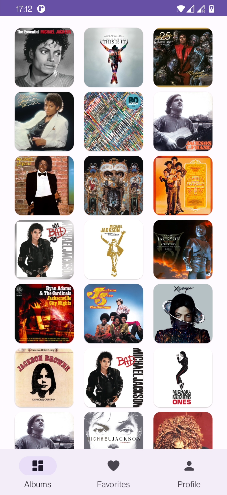
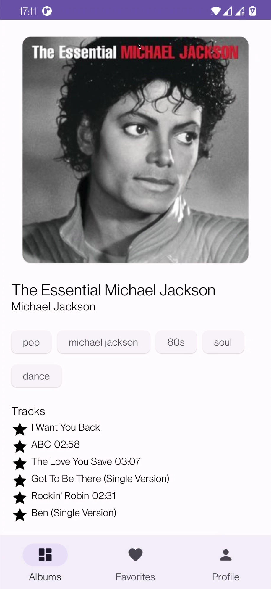
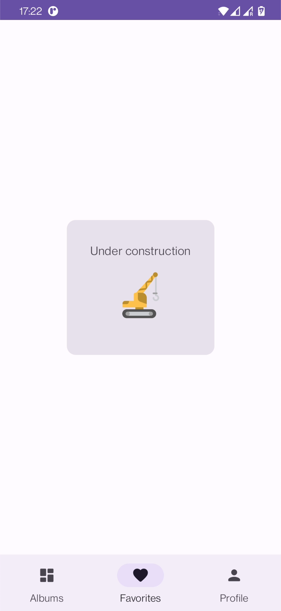

# 💎 Android Showcase 2.0

[](https://kotlinlang.org)
[](https://developer.android.com/studio/releases/gradle-plugin)
[](https://gradle.org)

[](https://codebeat.co/projects/github-com-igorwojda-android-showcase-main)
[](https://www.codefactor.io/repository/github/igorwojda/android-showcase)

The Android Showcase project exemplifies modern [Android](https://en.wikipedia.org/wiki/Android_(operating_system)) application development methodologies and provides comprehensive architectural guidance. By integrating popular development tools, libraries, linters, and Gradle plugins, along with robust testing frameworks and Continuous Integration (CI) setup, this project offers a holistic sample of a fully operational Android application.

The primary focus of this project lies in promoting a modular, scalable, maintainable, and testable [architecture](#architecture). It incorporates a leading-edge [tech-stack](#tech-stack) and embodies the finest practices in software development. While the application may appear straightforward, it encompasses all the crucial components that lay the groundwork for a robust, large-scale application.

The design principles and architectural choices applied in this project are ideally suited for larger teams and extended [application lifecycles](https://en.wikipedia.org/wiki/Application_lifecycle_management). This application is not just about showcasing functionalities, but it is also a testament to how well-structured and well-written code serves as a stable backbone for scalable and maintainable software development projects.

- [💎 Android Showcase 2.0](#-android-showcase-20)
  - [Application Scope](#application-scope)
  - [Tech-Stack](#tech-stack)
  - [Architecture](#architecture)
    - [Module Types And Module Dependencies](#module-types-and-module-dependencies)
    - [Feature Module Structure](#feature-module-structure)
      - [Presentation Layer](#presentation-layer)
      - [Domain Layer](#domain-layer)
      - [Data Layer](#data-layer)
    - [Data Flow](#data-flow)
  - [Dependency Management](#dependency-management)
  - [Logcat debugging](#logcat-debugging)
  - [CI Pipeline](#ci-pipeline)
    - [Pull Request Verification](#pull-request-verification)
  - [Design Decisions](#design-decisions)
  - [What This Project Does Not Cover?](#what-this-project-does-not-cover)
  - [Getting Started](#getting-started)
    - [Android Studio](#android-studio)
    - [Command-line And Android Studio](#command-line-and-android-studio)
    - [Plugins](#plugins)
  - [Upcoming Improvements](#upcoming-improvements)
  - [Inspiration](#inspiration)
    - [Cheatsheet](#cheatsheet)
    - [Android Projects](#android-projects)
  - [Known Issues](#known-issues)
  - [Contribute](#contribute)
  - [Author](#author)
  - [License](#license)
  - [Animations License](#animations-license)

## Application Scope

The android-showcase is a simple application that presents information about various music albums. This data is dynamically sourced from the [Last.fm](https://www.last.fm/api)  music platform API.

The app has a few screens located in multiple feature modules:

- Album list screen - displays list of albums
- Album detail screen - display information about the selected album
- Profile screen - empty (WiP)
- Favourites screen - empty (WiP)
  <br/><br/>

<p>
  
  
  
</p>

## Tech-Stack

This project takes advantage of best practices and many popular libraries and tools in the Android ecosystem. Most of
the libraries are in the stable version unless there is a good reason to use non-stable dependency.

* Tech-stack
  * [100% Kotlin](https://kotlinlang.org/)
    + [Coroutines](https://kotlinlang.org/docs/reference/coroutines-overview.html) - perform background operations
    + [Kotlin Flow](https://kotlinlang.org/docs/flow.html) - data flow across all app layers, including views
    + [Kotlin Symbol Processing](https://kotlinlang.org/docs/ksp-overview.html) - enable compiler plugins
    + [Kotlin Serialization](https://kotlinlang.org/docs/serialization.html) - parse [JSON](https://www.json.org/json-en.html)
  * [Retrofit](https://square.github.io/retrofit/) - networking
  * [Jetpack](https://developer.android.com/jetpack)
    * [Compose](https://developer.android.com/jetpack/compose) - modern, native UI kit
    * [Navigation](https://developer.android.com/topic/libraries/architecture/navigation/) - in-app navigation
    * [Lifecycle](https://developer.android.com/topic/libraries/architecture/lifecycle) - perform an action when
      lifecycle state changes
    * [ViewModel](https://developer.android.com/topic/libraries/architecture/viewmodel) - store and manage UI-related
      data in a lifecycle-aware way
    * [Room](https://developer.android.com/jetpack/androidx/releases/room) - store offline cache
  * [Koin](https://insert-koin.io/) - dependency injection (dependency retrieval)
  * [Coil](https://github.com/coil-kt/coil) - image loading library
  * [Lottie](http://airbnb.io/lottie) - animation library
* Modern Architecture
  * [Clean Architecture](https://blog.cleancoder.com/uncle-bob/2012/08/13/the-clean-architecture.html)
  * Single activity architecture
    using [Navigation component](https://developer.android.com/guide/navigation/navigation-getting-started)
  * MVVM + MVI (presentation layer)
  * [Android Architecture components](https://developer.android.com/topic/libraries/architecture)
    ([ViewModel](https://developer.android.com/topic/libraries/architecture/viewmodel)
    , [Kotlin Flow](https://kotlinlang.org/docs/flow.html)
    , [Navigation](https://developer.android.com/jetpack/androidx/releases/navigation))
  * [Android KTX](https://developer.android.com/kotlin/ktx) - Jetpack Kotlin extensions
* UI
  * Reactive UI
  * [Jetpack Compose](https://developer.android.com/jetpack/compose) - modern, native UI kit (used for Fragments)
  * [View Binding](https://developer.android.com/topic/libraries/view-binding) - retrieve XML view ids
    (used for [NavHostActivity](app/src/main/java/com/igorwojda/showcase/app/presentation/NavHostActivity.kt) only)
  * [Material Design 3](https://m3.material.io/) - application design system providing UI components
  * Theme selection
    * [Dark Theme](https://material.io/develop/android/theming/dark) - dark theme for the app (Android 10+)
    * [Dynamic Theming](https://m3.material.io/styles/color/dynamic-color/overview) - use generated, wallpaper-based
      theme (Android 12+)
* CI
  * [GitHub Actions](https://github.com/features/actions)
  * Automatic PR verification including tests, linters, and 3rd online tools
* Testing
  * [Unit Tests](https://en.wikipedia.org/wiki/Unit_testing) ([JUnit 5](https://junit.org/junit5/) via
    [android-junit5](https://github.com/mannodermaus/android-junit5)) - test individual classes
  * [Konsist](https://docs.konsist.lemonappdev.com/) - test code conventions and architectural rules
  * [UI Tests](https://en.wikipedia.org/wiki/Graphical_user_interface_testing) ([Espresso](https://developer.android.com/training/testing/espresso)) -
    test user interface (WiP)
  * [Mockk](https://mockk.io/) - mocking framework
  * [Kluent](https://github.com/MarkusAmshove/Kluent) - assertion framework
* Static analysis tools (linters)
  * [Ktlint](https://github.com/pinterest/ktlint) - verify code formatting
  * [Detekt](https://github.com/arturbosch/detekt#with-gradle) - verify code complexity and code smells
  * [Android Lint](http://tools.android.com/tips/lint) - verify Android platform usage
* Gradle
  * [Gradle Kotlin DSL](https://docs.gradle.org/current/userguide/kotlin_dsl.html) - define build scripts
  * Custom tasks
  * [Gradle Plugins](https://plugins.gradle.org/)
    * [Android Gradle](https://developer.android.com/studio/releases/gradle-plugin) - standard Android Plugins
    * [Test Logger](https://github.com/radarsh/gradle-test-logger-plugin) - format test logs
    * [SafeArgs](https://developer.android.com/guide/navigation/navigation-pass-data#Safe-args) - pass data between
      navigation destinations
    * [Android-junit5](https://github.com/mannodermaus/android-junit5) - use [JUnit 5](https://junit.org/junit5/) with Android
  * [Versions catalog](https://docs.gradle.org/current/userguide/platforms.html#sub:version-catalog) - define dependencies
  * [Type safe accessors](https://docs.gradle.org/7.0/release-notes.html)
* GitHub Boots
  * [Renovate](https://github.com/renovatebot/renovate) - automatically update dependencies
  * [Stale](https://github.com/marketplace/stale) - automatically closes stale Issues and Pull Requests that tend to accumulate during a project
* Other Tools
  * Charles Proxy - enabled network traffic sniffing in `debug` builds.

## Architecture

By dividing a problem into smaller and easier-to-solve sub-problems, we can reduce the complexity of designing and
maintaining a large system. Each module is an independent build block serving a clear purpose. We can think about each
feature as a reusable component, the equivalent of [microservice](https://en.wikipedia.org/wiki/Microservices) or private
library.

The modularized code-base approach provides a few benefits:

- reusability - enable code sharing and building multiple apps from the same foundation. Apps should be a sum of their features where the features are organized as separate modules.
- [separation of concerns](https://en.wikipedia.org/wiki/Separation_of_concerns) - each module has a clear API.
  Feature-related classes live in different modules and can't be referenced without explicit module dependency. We
  strictly control what is exposed to other parts of your codebase.
- features can be developed in parallel eg. by different teams
- each feature can be developed in isolation, independently from other features
- faster build time

### Module Types And Module Dependencies

This diagram presents dependencies between project modules (Gradle sub-projects).


We have three kinds of modules in the application:

- `app` module - this is the main module. It contains code that wires multiple modules together (class, dependency
  injection setup, `NavHostActivity`, etc.) and fundamental application configuration (retrofit configuration, required
  permissions setup, custom `Application` class, etc.).
- `feature_x` modules - the most common type of module containing all code related to a given feature.
  share some assets or code only between `feature` modules (currently app has no such modules)
- `feature_base` modules that feature modules depend on to share a common code.

### Feature Module Structure

`Clean Architecture` is implemented at the module level - each module contains its own set of Clean Architecture layers:


> Notice that the `app` module and `library_x` modules structure differs a bit from the feature module structure.

Each feature module contains non-layer components and 3 layers with a distinct set of responsibilities.


#### Presentation Layer

This layer is closest to what the user sees on the screen.

The `presentation` layer mixes `MVVM` and `MVI` patterns:

- `MVVM` - Jetpack `ViewModel` is used to encapsulate a `common UI state`. It exposes the `state` via observable state
  holder (`Kotlin Flow`)
- `MVI` - `action` modifies the `common UI state` and emits a new state to a view via `Kotlin Flow`

> The `common state` is a single source of truth for each view. This solution derives from
> [Unidirectional Data Flow](https://en.wikipedia.org/wiki/Unidirectional_Data_Flow_(computer_science)) and [Redux
> principles](https://redux.js.org/introduction/three-principles).

This approach facilitates the creation of consistent states. The state is collected via `collectAsUiStateWithLifecycle`
method. Flows collection happens in a lifecycle-aware manner, so
[no resources are wasted](https://medium.com/androiddevelopers/consuming-flows-safely-in-jetpack-compose-cde014d0d5a3).

Stated is annotated with [Immutable](https://developer.android.com/reference/kotlin/androidx/compose/runtime/Immutable)
annotation that is used by Jetpack compose to enable composition optimizations.

Components:

- **View (Fragment)** - observes common view state (through `Kotlin Flow`). Compose transform state (emitted by Kotlin
  Flow) into application UI Consumes the state and transforms it into application UI (via `Jetpack Compose`). Pass user
  interactions to `ViewModel`. Views are hard to test, so they should be as simple as possible.
- **ViewModel** - emits (through `Kotlin Flow`) view state changes to the view and deals with user interactions (these
  view models are not simply [POJO classes](https://en.wikipedia.org/wiki/Plain_old_Java_object)).
- **ViewState** - common state for a single view
- **StateTimeTravelDebugger** - logs actions and view state transitions to facilitate debugging.
- **NavManager** - singleton that facilitates handling all navigation events inside `NavHostActivity` (instead of
  separately, inside each view)

#### Domain Layer

This is the core layer of the application. Notice that the `domain` layer is independent of any other layers. This
allows making domain models and business logic independent from other layers. In other words, changes in other layers
will not affect the `domain` layer eg. changing the database (`data` layer) or screen UI (`presentation` layer) ideally will
not result in any code change within the `domain` layer.

Components:

- **UseCase** - contains business logic
- **DomainModel** - defines the core structure of the data that will be used within the application. This is the source
  of truth for application data.
- **Repository interface** - required to keep the `domain` layer independent from
  the `data layer` ([Dependency inversion](https://en.wikipedia.org/wiki/Dependency_inversion_principle)).

#### Data Layer

Encapsulates application data. Provides the data to the `domain` layer eg. retrieves data from the internet and cache the
data in disk cache (when the device is offline).

Components:

- **Repository** is exposing data to the `domain` layer. Depending on the application structure and quality of the
  external API repository can also merge, filter, and transform the data. These operations intend to create
  a high-quality data source for the `domain` layer. It is the responsibility of the Repository (one or more) to construct
  Domain models by reading from the `Data Source` and accepting Domain models to be written to the `Data Source`
- **Mapper** - maps `data model` to `domain model` (to keep `domain` layer independent from the `data` layer).

This application has two `Data Sources` - `Retrofit` (used for network access) and `Room` (local storage used to access
device persistent memory). These data sources can be treated as an implicit sub-layer. Each data source consists of
multiple classes:

- **Retrofit Service** - defines a set of API endpoints
- **Retrofit Response Model** - definition of the network objects for a given endpoint (top-level model for the data
  consists of `ApiModels`)
- **Retrofit Api Data Model** - defines the network objects (sub-objects of the `Response Model`)
- **Room Database** - persistence database to store app data
- **Room DAO** - interact with the stored data
- **Room Entity** - definition of the stored objects

Both `Retrofit API Data Models` and `Room Entities` contain annotations, so the given framework understands how to parse the
data into objects.

### Data Flow

The below diagram presents application data flow when a user interacts with the `album list screen`:


## Dependency Management

Gradle [versions catalog](https://docs.gradle.org/current/userguide/platforms.html#sub:version-catalog) is used as a
centralized dependency management third-party dependency coordinates (group, artifact, version) are shared across all
modules (Gradle projects and subprojects).

All of the dependencies are stored in the [settings.gradle.kts](./settings.gradle.kts) file (default location).
Gradle versions catalog consists of a few major sections:

- `[versions]` - declare versions that can be referenced by all dependencies
- `[libraries]` - declare the aliases to library coordinates
- `[bundles]` - declare dependency bundles (groups)
- `[plugins]` - declare Gradle plugin dependencies

Each feature module depends on the `feature_base` module, so dependencies are shared without the need to add them
explicitly in each feature module.

The project enables the `TYPESAFE_PROJECT_ACCESSORS` experimental Gradle feature to generate type-safe accessors to refer other projects.

```kotlin
// Before
implementation(project(":feature_album"))

// After
implementation(projects.featureAlbum)
```

## Logcat debugging

To facilitate debuting project contains logs. You can filter logs to understand app flow. Keywords:
- `onCreate` see what `Activities` and `Fragments` have been created
- `Action` - filter all actions performed on the screens to update the UI
- `Http` - debug network requests and responses

## CI Pipeline

CI is utilizing [GitHub Actions](https://github.com/features/actions). The complete GitHub Actions config is located in
the [.github/workflows](.github/workflows) folder.

### Pull Request Verification

Series of workflows run (in parallel) for every opened PR and after merging PR to the `main` branch:

* `./gradlew lintDebug` - checks that source code satisfies Android lint rules
* `./gradlew detektCheck` - checks that sourcecode satisfies detekt rules
* `./gradlew detektApply` - applies detekt code formatting rules to sourcecode in-place
* `./gradlew spotlessCheck` - checks that source code satisfies formatting steps.
* `./gradlew spotlessApply` - applies code formatting steps to the source code in place.
* `./gradlew testDebugUnitTest` - run unit tests
* `./gradlew connectedCheck` - run UI tests
* `./gradlew :app:bundleDebug` - create an application bundle

## Design Decisions

Read related articles to have a better understanding of underlying design decisions and various trade-offs.

* [Multiple ways of defining Clean Architecture layers](https://proandroiddev.com/multiple-ways-of-defining-clean-architecture-layers-bbb70afa5d4a)
* ...

## What This Project Does Not Cover?

The interface of the app utilizes some of the modern material design components, however, is deliberately kept simple to
focus on application architecture and project config.

## Getting Started

There are a few ways to open this project.

### Android Studio

1. `Android Studio` -> `File` -> `New` -> `From Version control` -> `Git`
2. Enter `https://github.com/igorwojda/android-showcase.git` into URL field and press `Clone` button

### Command-line And Android Studio

1. Run `git clone https://github.com/igorwojda/android-showcase.git` command to clone the project
2. Open `Android Studio` and select `File | Open...` from the menu. Select the cloned directory and press `Open` button

### Plugins

It is recommended to install [Detekt](https://plugins.jetbrains.com/plugin/10761-detekt) to Android Studio. To configure
the plugin open Android Studio preferences, open `Tools`, open `Detekt` and add [detekt.yml](detekt.yml) configuration file.

## Upcoming Improvements

This project is under active development and it is being occasionally refined.

Check the list of all upcoming
[enhancements](https://github.com/igorwojda/android-showcase/issues?q=is%3Aissue+is%3Aopen+sort%3Aupdated-desc+label%3Aenhancement).

## Inspiration

Here are a few additional resources.

### Cheatsheet

- [Material Theme Builder](https://m3.material.io/theme-builder#/dynamic) - generate dynamic material theme and see it
  in action
- [Compose Material 3 Components](https://developer.android.com/reference/kotlin/androidx/compose/material3/package-summary)
  \- a list containing material components
- [Core App Quality Checklist](https://developer.android.com/quality) - learn about building the high-quality app
- [Android Ecosystem Cheat Sheet](https://github.com/igorwojda/android-ecosystem-cheat-sheet) - board containing 200+
  most important tools
- [Kotlin Coroutines - Use Cases on Android](https://github.com/LukasLechnerDev/Kotlin-Coroutine-Use-Cases-on-Android) -
  most popular coroutine usages

### Android Projects

Other high-quality projects will help you to find solutions that work for your project (random order):

- [Compose Samples](https://github.com/android/compose-samples) - repository contains a set of individual Android Studio
- [Jetpack Compose Playground](https://github.com/Foso/Jetpack-Compose-Playground) - This is a Jetpack Compose example
  project
- [Now Android](https://github.com/android/nowinandroid) - fully functional Android app built entirely with Kotlin and
  Jetpack Compose
- [WhatsApp Clone Compose](https://github.com/getStream/whatsApp-clone-compose/) - WhatsApp clone app built with Jetpack
  Compose and Stream Chat SDK for Compose projects to help you learn about Compose in Android
- [Iosched](https://github.com/google/iosched) - official Android application from google IO 2019 and 2021
- [Android Architecture Blueprints v2](https://github.com/googlesamples/android-architecture) - a showcase of various
  Android architecture approaches to developing Android apps
- [Github Browser Sample](https://github.com/googlesamples/android-architecture-components) - multiple small projects
  demonstrating usage of Android Architecture Components
- [Clean Architecture Boilerplate](https://github.com/bufferapp/android-clean-architecture-boilerplate) - clean
  architecture for Android
- [Roxie](https://github.com/ww-tech/roxie) - a solid example of a `common state` approach together with very good
  documentation
- [Kotlin Android Template](https://github.com/cortinico/kotlin-android-template) - the template that lets you create
  preconfigured Android Kotlin project in a few seconds

### Other

- [Software Testing Fundamentals](https://softwaretestingfundamentals.com/) - great summary on application testing

## Known Issues

- In Gradle 8.1 the version catalog type safe API is not available for `buildSrc` directory, so dependencies and
  versions have to be retrieved using type unsafe API:
  - plugins are retrieved using string plugin ids
  - versions (`kotlinCompilerExtensionVersion`) are retrieved using string version names
- No usages are found for the `suspended` Kotlin `invoke`
  operator ([KTIJ-1053](https://youtrack.jetbrains.com/issue/KTIJ-1053/Find-usages-no-convention-usages-for-suspend-invoke-operator))
- The `Material You Dynamic Colors` are not correctly applied to Fragment contents (only to Activity)
- When using `FragmentContainerView`, `NavController` fragment can't be retrieved by
  using `findNavController()` ([ISSUE-142847973](https://issuetracker.google.com/issues/142847973),
  [STACKOVERFLOW-59275182](https://stackoverflow.com/questions/59275009/fragmentcontainerview-using-findnavcontroller/59275182))
- Mockk is unable to mock some methods with implicit `continuation`
  parameter in the `AlbumListViewModelTest` class ([Issue-957](https://github.com/mockk/mockk/issues/957)), , so test
  in the `AlbumDetailViewModelTest` was disabled
- Automatic Kotlin upgrade is disabled in Renovate, because these dependencies have to be updated together with Kotlin:
  until:
  - [Jetpack compose compiler](https://developer.android.com/jetpack/androidx/releases/compose-kotlin)
  - [KSP](https://repo.maven.apache.org/maven2/com/google/devtools/ksp/symbol-processing-gradle-plugin/)
- [Dynamic feature module](https://developer.android.com/studio/projects/dynamic-delivery) is not supported by
  `ANDROID_TEST_USES_UNIFIED_TEST_PLATFORM` yet.
- ktlint `FileName` rule has to be disabled, because it is not compatible with fie contain a single extension
  [ISSUE-1657](https://github.com/pinterest/ktlint/issues/1657)
- Delegate import is not provided when a variable has the same name as
  Delegate ([KTIJ-17403](https://youtrack.jetbrains.com/issue/KTIJ-17403))
- `androidx.compose.runtime.getValue` and `androidx.compose.runtime.setValue` imports are can't be resolved
  automatically - they had to be added manually [KTIJ-23200](https://youtrack.jetbrains.com/issue/KTIJ-23200)
- [ktlint import-ordering](https://github.com/pinterest/ktlint/blob/master/ktlint-ruleset-standard/src/main/kotlin/com/pinterest/ktlint/ruleset/standard/ImportOrderingRule.kt)
  rule conflicts with IDE default formatting rule, so it have to be [.editorconfig](.editorconfig) file.
  and [KTIJ-16847](https://youtrack.jetbrains.com/issue/KTIJ-16847))
- False positive "Unused symbol" for a custom Android application class referenced in `AndroidManifest.xml`
  file ([KT-27971](https://youtrack.jetbrains.net/issue/KT-27971))
- Android lint complains about exceeding access rights to
  `ArchTaskExecutor` ([Issue 79189568](https://issuetracker.google.com/u/0/issues/79189568))
- JUnit 5 does not support tests with suspended
  modifier ([Issue 1914](https://github.com/junit-team/junit5/issues/1914))
- Custom detekt config is hard to update ([Issue 4517](https://github.com/detekt/detekt/issues/4517))
- Coil does not provide a way to automatically retry image load, so some images may not be loaded when connection speed
  is low ([Issue 132](https://github.com/coil-kt/coil/issues/132))
- `buildFeatures` and `testOptions` blocks are incubating and have to be marked as `@Suppress
  ("UnstableApiUsage")`

## Contribute

This project is being maintained to stay up to date with leading industry standards. Please check
the [CONTRIBUTING](CONTRIBUTING.md) page if you want to help.

## Author

[](https://twitter.com/igorwojda)

[](https://twitter.com/igorwojda)

## License

```
MIT License

Copyright (c) 2019 Igor Wojda

Permission is hereby granted, free of charge, to any person obtaining a copy of this software and
associated documentation files (the "Software"), to deal in the Software without restriction, including
without limitation the rights to use, copy, modify, merge, publish, distribute, sublicense, and/or sell
copies of the Software, and to permit persons to whom the Software is furnished to do so, subject to
the following conditions:

The above copyright notice and this permission notice shall be included in all copies or substantial
portions of the Software.

THE SOFTWARE IS PROVIDED "AS IS", WITHOUT WARRANTY OF ANY KIND, EXPRESS OR IMPLIED, INCLUDING BUT NOT
LIMITED TO THE WARRANTIES OF MERCHANTABILITY, FITNESS FOR A PARTICULAR PURPOSE AND NONINFRINGEMENT. IN
NO EVENT SHALL THE AUTHORS OR COPYRIGHT HOLDERS BE LIABLE FOR ANY CLAIM, DAMAGES OR OTHER LIABILITY,
WHETHER IN AN ACTION OF  TORT OR OTHERWISE, ARISING FROM, OUT OF OR IN CONNECTION WITH THE
SOFTWARE OR THE USE OR OTHER DEALINGS IN THE SOFTWARE.
```

## Animations License

Flowing animations are distributed under `Creative Commons License 2.0`:

- [Error screen](https://lottiefiles.com/8049-error-screen) by Chetan Potnuru
- [Building Screen](https://lottiefiles.com/1271-building-screen) by Carolina Cajazeira
