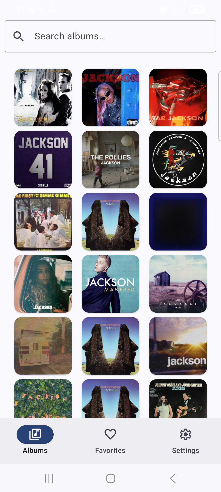
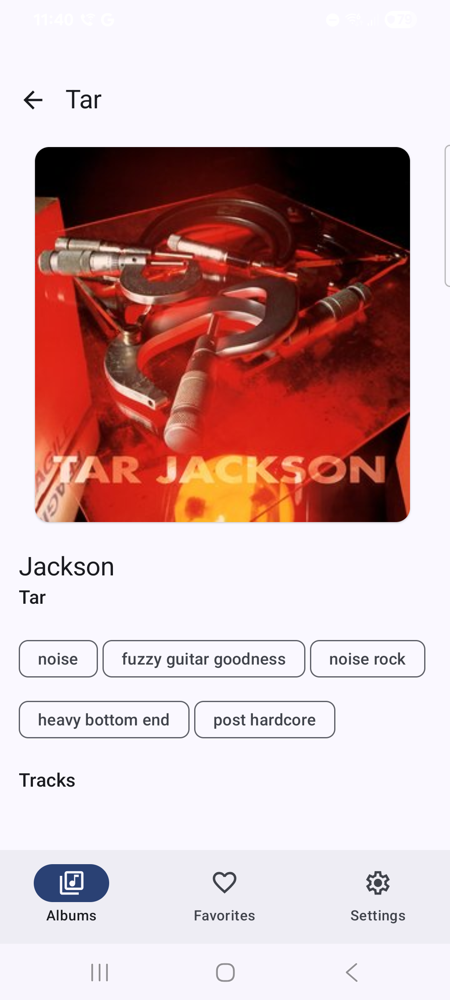
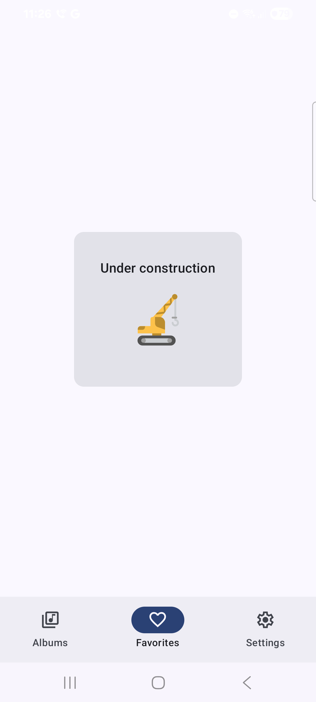
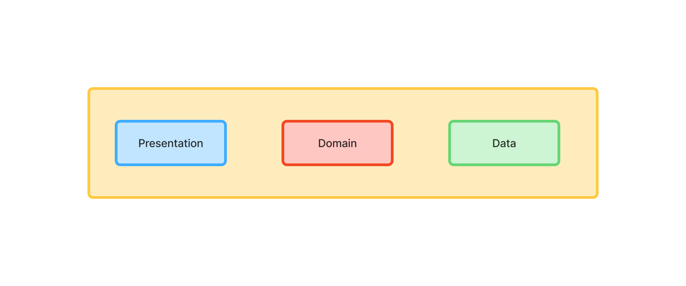
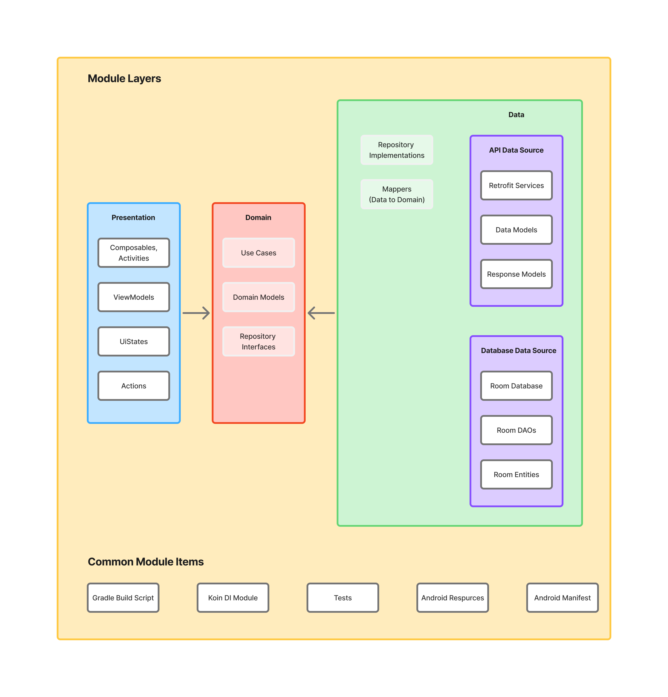
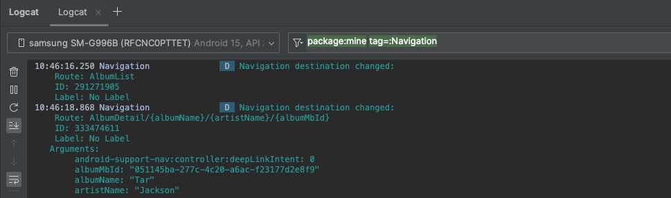
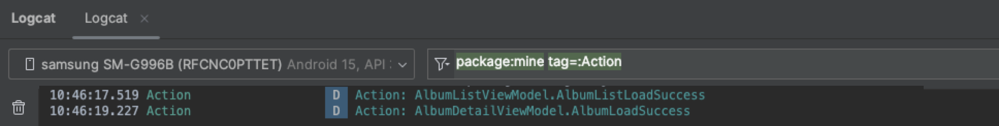
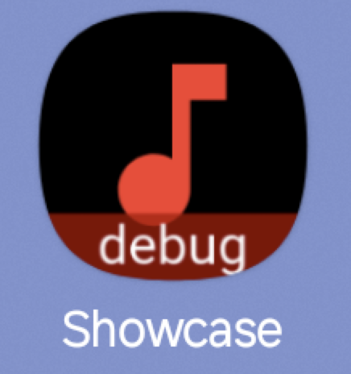
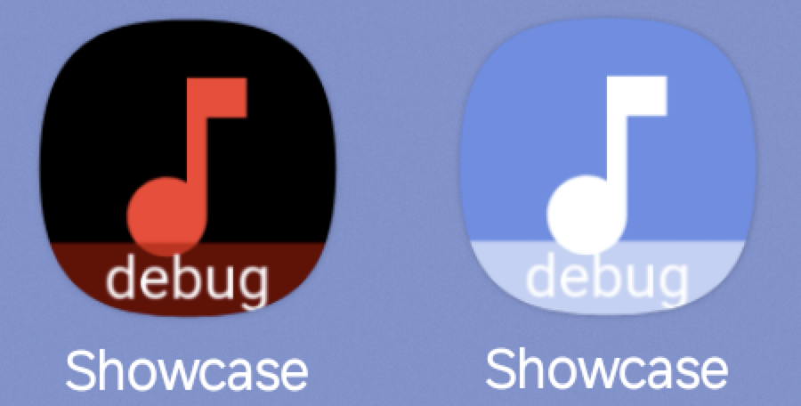

# 💎 Android Showcase 2.0

[](https://kotlinlang.org)
[](https://developer.android.com/studio/releases/gradle-plugin)
[](https://gradle.org)
[](https://www.codefactor.io/repository/github/igorwojda/android-showcase)

A production-ready Android application demonstrating modern development practices and architectural patterns. This project showcases how to build scalable, maintainable, and testable Android applications using industry-standard tools and libraries.

Built with **Clean Architecture** principles, this app serves as a comprehensive example of modular design, advanced Gradle configuration, and robust CI/CD practices. Perfect for teams looking to establish solid architectural foundations for large-scale Android projects.

- [💎 Android Showcase 2.0](#-android-showcase-20)
  - [Application Scope](#application-scope)
  - [Tech-Stack](#tech-stack)
  - [Architecture](#architecture)
    - [Module Types and Dependencies](#module-types-and-dependencies)
    - [Feature Module Structure](#feature-module-structure)
      - [Presentation Layer](#presentation-layer)
      - [Domain Layer](#domain-layer)
      - [Data Layer](#data-layer)
      - [Common Module Components](#common-module-components)
    - [Data Flow](#data-flow)
  - [Project Features](#project-features)
    - [Development \& Debugging](#development--debugging)
    - [Custom Icons For Each Variant](#custom-icons-for-each-variant)
    - [Themed Icons](#themed-icons)
  - [Gradle Config](#gradle-config)
    - [Dependency Management](#dependency-management)
    - [Convention Plugins](#convention-plugins)
    - [Type Safe Project Accessors](#type-safe-project-accessors)
    - [Unified Version Configuration](#unified-version-configuration)
      - [Java/JVM Version Configuration](#javajvm-version-configuration)
    - [Generated type-safe version catalogs accessors in `buildLogic` module](#generated-type-safe-version-catalogs-accessors-in-buildlogic-module)
  - [Code Verification](#code-verification)
    - [CI Pipeline](#ci-pipeline)
    - [Pre-push Hooks](#pre-push-hooks)
  - [Project Scope \& Limitations](#project-scope--limitations)
  - [Getting Started](#getting-started)
  - [Roadmap](#roadmap)
  - [Resources](#resources)
  - [Contributing](#contributing)
  - [Author](#author)
  - [License](#license)
  - [Animations License](#animations-license)

## Application Scope

A music discovery app built with Jetpack Compose that displays album information sourced from the [Last.fm API](https://www.last.fm/api). The application demonstrates real-world scenarios including network requests, local caching, navigation, and state management.

**Features:**
- **Album List** - Browse albums with search functionality
- **Album Details** - View detailed album information and track listings  
- **Favorites** - Save preferred albums (WIP)
- **Profile** - User preferences and settings (WIP)

<p>
  
  
  
</p>

## Tech-Stack

Built with modern Android development tools and libraries, prioritizing, project structure stability and production-readiness.

**Core Technologies:**
- **[Kotlin 2.2+](https://kotlinlang.org/)** - Modern, expressive programming language
  - **[Coroutines](https://kotlinlang.org/docs/coroutines-overview.html)** - Asynchronous programming
  - **[Flow](https://kotlinlang.org/docs/flow.html)** - Reactive data streams
  - **[KSP (Kotlin Symbol Processing)](https://kotlinlang.org/docs/ksp-overview.html)** - Kotlin Symbol Processing
  - **[Serialization](https://kotlinlang.org/docs/serialization.html)** - JSON parsing

**Android Jetpack:**
- **[Compose](https://developer.android.com/jetpack/compose)** - Declarative UI framework
- **[Navigation Compose](https://developer.android.com/jetpack/compose/navigation)** - Type-safe navigation
- **[ViewModel](https://developer.android.com/topic/libraries/architecture/viewmodel)** - UI-related data management
- **[Room](https://developer.android.com/jetpack/androidx/releases/room)** - Local database with SQLite

**Networking & Images:**
- **[Retrofit](https://square.github.io/retrofit/)** - HTTP client for API communication
- **[Coil](https://github.com/coil-kt/coil)** - Image loading optimized for Compose

**Dependency Injection:**
- **[Koin](https://insert-koin.io/)** - Lightweight dependency injection framework

**Architecture:**
- **[Clean Architecture](https://blog.cleancoder.com/uncle-bob/2012/08/13/the-clean-architecture.html)** - Separation of concerns with defined layers
- **Single Activity Architecture** - Modern navigation approach
- **MVVM + MVI** - Reactive presentation layer pattern providing common UI state.
- **Modular Design** - Feature-based modules for scalability

**UI & Design:**
- **[Material Design 3](https://m3.material.io/)** - Latest design system
- **[Dynamic Theming](https://m3.material.io/styles/color/dynamic-color/overview)** - Wallpaper-based themes (Android 12+)
- **[Dark Theme](https://material.io/develop/android/theming/dark)** - System-aware dark mode
- **[Lottie](http://airbnb.io/lottie)** - Vector animations

**Testing:**
- **[JUnit 5](https://junit.org/junit5/)** - Modern testing framework
- **[Mockk](https://mockk.io/)** - Kotlin-first mocking library
- **[Kluent](https://github.com/MarkusAmshove/Kluent)** - Fluent assertion library
- **[Espresso](https://developer.android.com/training/testing/espresso)** - UI testing (WIP)

**Code Quality:**
- **[Konsist](https://docs.konsist.lemonappdev.com/)** - Architecture and code structure convention tests
- **[Ktlint](https://github.com/pinterest/ktlint)** - Kotlin code formatting and issue detection
  - **[Ktlint Standard Rules](https://pinterest.github.io/ktlint/0.49.1/rules/standard/)** - set of custom rules for Jetpack Compose
  - **[Nlopez Jetpack Compose Rules](https://mrmans0n.github.io/compose-rules/)** - set of custom rules for Jetpack Compose
  - **[Twitter's Jetpack Compose Rules](https://twitter.github.io/compose-rules/)** - set of custom rules for Jetpack Compose
- **[Detekt](https://github.com/arturbosch/detekt)** - Static analysis and complexity checks
- **[Android Lint](http://tools.android.com/tips/lint)** - Android-specific code analysis
- **[Spotless](https://github.com/diffplug/spotless)** - Code formatting enforcement

**Build & CI:**
- **[Gradle Kotlin DSL](https://docs.gradle.org/current/userguide/kotlin_dsl.html)** - Type-safe build scripts
- **[Version Catalogs](https://docs.gradle.org/current/userguide/platforms.html#sub:version-catalog)** - Centralized dependency management
- **[Convention Plugins](https://docs.gradle.org/current/samples/sample_convention_plugins.html)** - Shared build logic
- **[Renovate](https://github.com/renovatebot/renovate)** - Automated dependency updates

**GitHub Actions:**
- **[Check](.github/workflows/check.yml)** - CI pipeline with build, lint, test, and code quality checks
- **[Auto Approve](.github/workflows/auto-approve.yml)** - Auto-approval for trusted bot and maintainer PRs
- **[Claude Code](.github/workflows/claude.yml)** - AI-powered code assistance and review
- **[Claude Code Review](.github/workflows/claude-code-review.yml)** - Automated PR reviews using Claude

**Gradle Plugins:**
- **[Android Application](https://developer.android.com/build/releases/gradle-plugin)** (`com.android.application`) - Android app module configuration
- **[Android Library](https://developer.android.com/build/releases/gradle-plugin)** (`com.android.library`) - Android library module configuration
- **[Kotlin Android](https://kotlinlang.org/docs/gradle.html)** (`org.jetbrains.kotlin.android`) - Kotlin compilation for Android
- **[Kotlin Serialization](https://kotlinlang.org/docs/serialization.html)** (`org.jetbrains.kotlin.plugin.serialization`) - JSON serialization support
- **[Kotlin Compose Compiler](https://developer.android.com/jetpack/androidx/releases/compose-kotlin)** (`org.jetbrains.kotlin.plugin.compose`) - Compose compiler plugin
- **[KSP](https://kotlinlang.org/docs/ksp-overview.html)** (`com.google.devtools.ksp`) - Kotlin Symbol Processing
- **[Detekt](https://detekt.dev/)** (`io.gitlab.arturbosch.detekt`) - Static code analysis
- **[Spotless](https://github.com/diffplug/spotless)** (`com.diffplug.spotless`) - Code formatting
- **[Test Logger](https://github.com/radarsh/gradle-test-logger-plugin)** (`com.adarshr.test-logger`) - Enhanced test log output
- **[Easylauncher](https://github.com/usefulness/easylauncher-gradle-plugin)** (`com.starter.easylauncher`) - modify the launcher icon of each of your app-variants

## Architecture

The project implements **Clean Architecture** with a modular approach, treating each feature as an independent, reusable component similar to a microservice. This design enables maintainability and scalability for large development teams.

**Benefits of Modular Architecture:**
- **Reusability** - Shared code across multiple app variants
- **Separation of Concerns** - Clear module boundaries with explicit dependencies
- **Parallel Development** - Teams can work on features independently
- **Faster Build Times** - Incremental compilation and build caching
- **Testability** - Isolated testing of individual components

### Module Types and Dependencies


**Module Types:**
- **`app`** - Main application module containing navigation setup, DI configuration, and app-level components
- **`feature-*`** - Feature modules (album, profile, favourite) containing feature-specific business logic  
- **`feature-base`** - Shared foundation module providing common utilities and base classes
- **`library-*`** - Utility modules for testing and shared functionality

### Feature Module Structure

`Clean Architecture` is implemented at the module level - each module contains its own set of Clean Architecture layers:



> Notice that the `app` module and `library_x` modules structure differs a bit from the feature module structure.

Each feature module contains 3 layers with a distinct set of responsibilities and common module components.



#### Presentation Layer

This layer is closest to what the user sees on the screen.

The `presentation` layer mixes `MVVM` and `MVI` patterns:

- `MVVM` - Jetpack `ViewModel` is used to encapsulate a `common UI state`. It exposes the `state` via observable state
  holder (`Kotlin Flow`)
- `MVI` - `action` modifies the `common UI state` and emits a new state to a view via `Kotlin Flow`

> The `common state` is a single source of truth for each view. This solution derives from
> [Unidirectional Data Flow](https://en.wikipedia.org/wiki/Unidirectional_Data_Flow_(computer_science)) and [Redux
> principles](https://redux.js.org/introduction/three-principles).

This approach facilitates the creation of consistent states. The state is collected via `collectAsUiStateWithLifecycle`
method. Flows collection happens in a lifecycle-aware manner, so
[no resources are wasted](https://medium.com/androiddevelopers/consuming-flows-safely-in-jetpack-compose-cde014d0d5a3).

Stated is annotated with [Immutable](https://developer.android.com/reference/kotlin/androidx/compose/runtime/Immutable)
annotation that is used by Jetpack compose to enable composition optimizations.

Components:

- **Screen (Composable)** - observes common view state (through `Kotlin Flow`). Compose transform state (emitted by Kotlin
  Flow) into application UI Consumes the state and transforms it into application UI (via `Jetpack Compose`). Pass user
  interactions to `ViewModel`. Views are hard to test, so they should be as simple as possible.
- **ViewModel** - emits (through `Kotlin Flow`) view state changes to the view and deals with user interactions (these
  view models are not simply [POJO classes](https://en.wikipedia.org/wiki/Plain_old_Java_object)).
- **ViewState** - common state for a single view
- **StateTimeTravelDebugger** - logs actions and view state transitions to facilitate debugging.
- **NavManager** - singleton that facilitates handling all navigation events inside `NavHostActivity` (instead of
  separately, inside each view)

#### Domain Layer

This is the core layer of the application. Notice that the `domain` layer is independent of any other layers. This
allows making domain models and business logic independent from other layers. In other words, changes in other layers
will not affect the `domain` layer eg. changing the database (`data` layer) or screen UI (`presentation` layer) ideally will
not result in any code change within the `domain` layer.

Components:

- **UseCase** - contains business logic
- **DomainModel** - defines the core structure of the data that will be used within the application. This is the source
  of truth for application data.
- **Repository interface** - required to keep the `domain` layer independent from
  the `data layer` ([Dependency inversion](https://en.wikipedia.org/wiki/Dependency_inversion_principle)).

#### Data Layer

Encapsulates application data. Provides the data to the `domain` layer eg. retrieves data from the internet and cache the
data in disk cache (when the device is offline).

Components:

- **Repository** is exposing data to the `domain` layer. Depending on the application structure and quality of the
  external API repository can also merge, filter, and transform the data. These operations intend to create
  a high-quality data source for the `domain` layer. It is the responsibility of the Repository (one or more) to construct
  Domain models by reading from the `Data Source` and accepting Domain models to be written to the `Data Source`
- **Mapper** - maps `data model` to `domain model` (to keep `domain` layer independent from the `data` layer).

This application has two `Data Sources` - `Retrofit` (used for network access) and `Room` (local storage used to access
device persistent memory). These data sources can be treated as an implicit sub-layer. Each data source consists of
multiple classes:

- **Retrofit Service** - defines a set of API endpoints
- **Retrofit Response Model** - definition of the network objects for a given endpoint (top-level model for the data
  consists of `ApiModels`)
- **Retrofit Api Data Model** - defines the network objects (sub-objects of the `Response Model`)
- **Room Database** - persistence database to store app data
- **Room DAO** - interact with the stored data
- **Room Entity** - definition of the stored objects

Both `Retrofit API Data Models` and `Room Entities` contain annotations, so the given framework understands how to parse the
data into objects.

#### Common Module Components

Each module in the Android project contains several standard items that provide essential functionality and configuration:

Components:
- **Gradle Build Script** - `build.gradle.kts` defining dependencies, build configurations, and plugins.
- **Koin DI Module** - Dependency injection configuration
- **Tests** - Unit tests (`test/`) and integration tests (`androidTest/`)
- **Android Resources** - resources (`res/`) including strings, drawables, and assets.
- **Android Manifest** - The `AndroidManifest.xml` file declaring module metadata.

### Data Flow

The below diagram presents application data flow when a user interacts with the `album list screen`:


## Project Features

### Development & Debugging

The app provides detailed logging for development and debugging, with each log easily filterable by its tag:

- `Navigation` - Navigation targets


- `Action` - Actions that modify UI state


- `Network` - Network requests/responses


### Custom Icons For Each Variant

Thanks to [Easylauncher Gradle plugin](https://github.com/usefulness/easylauncher-gradle-plugin) the `debug` build has custom icon label:



### Themed Icons

App supports [Themed Icons](https://medium.com/@enikebraimoh/android-themed-icons-a-comprehensive-guide-3abb33ab51a7).

Left (classic icon), Right (themed icon):



## Gradle Config

### Dependency Management

Gradle [versions catalog](https://docs.gradle.org/current/userguide/platforms.html#sub:version-catalog) is used as a centralized dependency management third-party dependency coordinates (group, artifact, version) are shared across all modules (Gradle projects and subprojects).

Gradle versions catalog consists of a few major sections:

- `[versions]` - declare versions that can be referenced by all dependencies
- `[libraries]` - declare the aliases to library coordinates
- `[bundles]` - declare dependency bundles (groups)
- `[plugins]` - declare Gradle plugin dependencies

Each module uses convention a plugin, so common dependencies are shared without the need to add them explicitly in each module.

### Convention Plugins

[Convention plugins](https://docs.gradle.org/current/samples/sample_convention_plugins.html) standardize build configuration across modules by encapsulating common build logic into reusable plugins:

- **[`Application Convention`](./buildLogic/src/main/kotlin/com/igorwojda/showcase/buildlogic/ApplicationConventionPlugin.kt)** - Main application module configuration with Android app setup
- **[`Feature Convention`](./buildLogic/src/main/kotlin/com/igorwojda/showcase/buildlogic/FeatureConventionPlugin.kt)** - Feature module configuration combining library and Kotlin conventions
- **[`Library Convention`](./buildLogic/src/main/kotlin/com/igorwojda/showcase/buildlogic/LibraryConventionPlugin.kt)** - Android library module setup with common Android configuration
- **[`Lotlin Convention`](./buildLogic/src/main/kotlin/com/igorwojda/showcase/buildlogic/KotlinConventionPlugin.kt)** - Kotlin compilation settings, toolchain, and compiler options
- **[`Test Convention`](./buildLogic/src/main/kotlin/com/igorwojda/showcase/buildlogic/TestConventionPlugin.kt)** - Testing framework setup (JUnit 5, test logging, and test configurations)
- **[`Test Library Convention`](./buildLogic/src/main/kotlin/com/igorwojda/showcase/buildlogic/TestConventionLibraryPlugin.kt)** - Testing setup specifically for library modules
- **[`Detekt Convention`](./buildLogic/src/main/kotlin/com/igorwojda/showcase/buildlogic/DetektConventionPlugin.kt)** - Static code analysis configuration with Detekt
- **[`Spotless Convention`](./buildLogic/src/main/kotlin/com/igorwojda/showcase/buildlogic/SpotlessConventionPlugin.kt)** - Code formatting and style enforcement with Spotless
- **[`Easylauncher Convention`](./buildLogic/src/main/kotlin/com/igorwojda/showcase/buildlogic/EasyLauncherConventionPlugin.kt)** - App icon customization for different build variants

### Type Safe Project Accessors

Enables type-safe project references instead of error-prone string-based module paths:

```kotlin
// Before
implementation(project(":feature:album"))

// After  
implementation(projects.feature.album)
```

### Unified Version Configuration

All dependency and Gradle plugin versions are defined in the TOML version catalog file ([libs.versions.toml](gradle/libs.versions.toml)).

#### Java/JVM Version Configuration

The Java/JVM version is centralized across the project.
It is defined once in [`libs.versions.toml`](gradle/libs.versions.toml) file under the java entry.
The `generateJavaBuildConfig` task reads this value and generates a `JavaBuildConfig.kt` file with constants.
These constants are then used in Gradle convention plugins to configure both Java and Kotlin consistently:

```kotlin
 compileOptions {
     sourceCompatibility = JavaBuildConfig.JAVA_VERSION
     targetCompatibility = JavaBuildConfig.JAVA_VERSION
 }
 
 kotlin {
     compilerOptions {
         jvmTarget = JavaBuildConfig.jvmTarget
     }

     jvmToolchain(JavaBuildConfig.jvmToolchainVersion)
 }
```

### Generated type-safe version catalogs accessors in `buildLogic` module 

Type-safe version catalogs accessors are accessible from precompiled script plugins in the `buildLogic` module. This is configured through the `versionCatalogs` block in `buildLogic/settings.gradle.kts` which references the main version catalog file, enabling access to dependencies like:

```kotlin
add("implementation", libs.koin)
```

## Code Verification

**Quality Checks:**
```bash
./gradlew konsistTest:test --rerun-tasks  # Architecture & convention validation
./gradlew lintDebug                       # Android lint analysis  
./gradlew detektCheck                     # Code complexity & style analysis
./gradlew spotlessCheck                   # Code formatting verification
./gradlew testDebugUnitTest               # Unit test execution
./gradlew connectedCheck                  # UI test execution (WIP)
./gradlew :app:bundleDebug                # Production build verification
```

**Auto-fix Commands:**
```bash
./gradlew detektApply                    # Apply Detekt formatting fixes
./gradlew spotlessApply                  # Apply code formatting fixes
./gradlew lintDebugBaseline              # Update lint baseline
```

### CI Pipeline

[GitHub Actions](https://github.com/features/actions) workflows execute quality checks automatically:
- **PR Validation** - All checks run in parallel on pull requests
- **Main Branch Protection** - Post-merge validation ensures code quality
- **Automated Dependency Updates** - Renovate bot creates PRs for dependency updates

Configuration: [`.github/workflows`](.github/workflows)

### Pre-push Hooks

Optional [Git hooks](https://git-scm.com/docs/githooks#_pre_push) can execute quality checks before pushing code, providing fast feedback during development.

## Project Scope & Limitations

This showcase prioritizes **architecture, tooling, and development practices** over complex UI design. The interface uses Material Design 3 components but remains intentionally straightforward to focus on the underlying technical implementation.

## Getting Started

**Prerequisites:**
- Android Studio Giraffe | 2022.3.1+ 
- JDK 17+
- Android SDK 34+

**Setup:**
```bash
# Clone the repository
git clone https://github.com/igorwojda/android-showcase.git

# Open in Android Studio
# File -> Open -> Select cloned directory
```

**Recommended IDE Plugins:**
- [Detekt](https://plugins.jetbrains.com/plugin/10761-detekt) - Configure with [detekt.yml](detekt.yml)
- [Kotlin](https://plugins.jetbrains.com/plugin/6954-kotlin) - Usually pre-installed
- [Android](https://developer.android.com/studio) - Usually pre-installed

## Roadmap

Active development continues with focus on modern Android practices. View planned [enhancements](https://github.com/igorwojda/android-showcase/issues?q=is%3Aissue+is%3Aopen+sort%3Aupdated-desc+label%3Aenhancement) and contribute ideas.

## Resources

**Development Tools:**
- [Material Theme Builder](https://m3.material.io/theme-builder#/dynamic) - Generate Material 3 dynamic themes
- [Compose Material 3 Components](https://developer.android.com/reference/kotlin/androidx/compose/material3/package-summary) - Component reference
- [Android Ecosystem Cheat Sheet](https://github.com/igorwojda/android-ecosystem-cheat-sheet) - 200+ essential Android tools
- [Kotlin Coroutines Use Cases](https://github.com/LukasLechnerDev/Kotlin-Coroutine-Use-Cases-on-Android) - Practical coroutine examples

**Recommended Projects:**
- [Now in Android](https://github.com/android/nowinandroid) - Google's official modern Android showcase
- [Android Architecture Blueprints](https://github.com/googlesamples/android-architecture) - Architecture pattern examples
- [Compose Samples](https://github.com/android/compose-samples) - Official Jetpack Compose examples
- [Kotlin Android Template](https://github.com/cortinico/kotlin-android-template) - Pre-configured project template
- [Androidify](https://github.com/android/androidify) - Android's official character customization app
- [WeatherXM Android](https://github.com/WeatherXM/wxm-android) - Weather data collection and rewards platform
- [Songify](https://github.com/JamesBuhanan/Songify) - Spotify-inspired music streaming app
- [Alkaa](https://github.com/igorescodro/alkaa) - Task management app with modern architecture
- [KotlinConf App](https://github.com/JetBrains/kotlinconf-app) - JetBrains' official conference app
- [Tivi](https://github.com/chrisbanes/tivi) - TV show tracking app by Chris Banes
- [CatchUp](https://github.com/ZacSweers/CatchUp) - News aggregation app with modular architecture
- [Heron](https://github.com/tunjid/heron) - Social media client showcasing modern Android development

## Contributing

Contributions are welcome! Please check the [CONTRIBUTING.md](CONTRIBUTING.md) guidelines before submitting PRs.

**Areas for Contribution:**
- Feature implementations (Profile, Favorites screens)
- UI/UX improvements and animations  
- Performance optimizations
- Testing coverage expansion
- Documentation improvements

## Author

**Igor Wojda** - Senior Android Engineer

[](https://twitter.com/igorwojda)
[](https://github.com/igorwojda)

## License

```
MIT License

Copyright (c) 2019 Igor Wojda

Permission is hereby granted, free of charge, to any person obtaining a copy of this software and
associated documentation files (the "Software"), to deal in the Software without restriction, including
without limitation the rights to use, copy, modify, merge, publish, distribute, sublicense, and/or sell
copies of the Software, and to permit persons to whom the Software is furnished to do so, subject to
the following conditions:

The above copyright notice and this permission notice shall be included in all copies or substantial
portions of the Software.

THE SOFTWARE IS PROVIDED "AS IS", WITHOUT WARRANTY OF ANY KIND, EXPRESS OR IMPLIED, INCLUDING BUT NOT
LIMITED TO THE WARRANTIES OF MERCHANTABILITY, FITNESS FOR A PARTICULAR PURPOSE AND NONINFRINGEMENT. IN
NO EVENT SHALL THE AUTHORS OR COPYRIGHT HOLDERS BE LIABLE FOR ANY CLAIM, DAMAGES OR OTHER LIABILITY,
WHETHER IN AN ACTION OF  TORT OR OTHERWISE, ARISING FROM, OUT OF OR IN CONNECTION WITH THE
SOFTWARE OR THE USE OR OTHER DEALINGS IN THE SOFTWARE.
```

## Animations License

Flowing animations are distributed under `Creative Commons License 2.0`:

- [Error screen](https://lottiefiles.com/8049-error-screen) by Chetan Potnuru
- [Building Screen](https://lottiefiles.com/1271-building-screen) by Carolina Cajazeira
